# OS Topic Graph

Generated from Operating System Concepts chapters (Ch5, Ch6, Ch7, Ch9, Ch10, Ch18)

## Topics

### Chapter 5: CPU Scheduling

| ID | Topic | Difficulty | Prerequisites |
|----|-------|------------|---------------|
| C5.1 | CPU-I/O burst cycle | 1 | [] |
| C5.2 | CPU scheduler (short-term scheduler) | 1 | [C5.1] |
| C5.3 | Dispatcher | 1 | [C5.2] |
| C5.4 | Dispatch latency | 2 | [C5.3] |
| C5.5 | Preemptive vs non-preemptive scheduling | 2 | [C5.2] |
| C5.6 | Scheduling criteria (utilization, throughput, turnaround, waiting, response) | 2 | [] |
| C5.7 | FCFS (First-Come First-Served) scheduling | 2 | [C5.2, C5.5] |
| C5.8 | Convoy effect | 2 | [C5.7] |
| C5.9 | SJF (Shortest-Job-First) scheduling | 2 | [C5.2] |
| C5.10 | SJF optimality (minimum average wait) | 3 | [C5.9, C5.6] |
| C5.11 | Exponential averaging for CPU burst prediction | 3 | [C5.9] |
| C5.12 | SRTF (Shortest-Remaining-Time-First) | 3 | [C5.9, C5.5] |
| C5.13 | Priority scheduling | 2 | [C5.2] |
| C5.14 | Starvation problem | 2 | [C5.13] |
| C5.15 | Aging solution to starvation | 3 | [C5.14] |
| C5.16 | Round Robin (RR) scheduling | 2 | [C5.2, C5.5] |
| C5.17 | Time quantum selection trade-offs | 3 | [C5.16] |
| C5.18 | Context switch overhead | 2 | [C5.3, C5.16] |
| C5.19 | Multilevel queue scheduling | 3 | [C5.16] |
| C5.20 | Multilevel feedback queue scheduling | 4 | [C5.19, C5.15] |
| C5.21 | Thread scheduling (PCS vs SCS) | 3 | [C5.2] |
| C5.22 | Multiple-processor scheduling | 3 | [C5.2] |
| C5.23 | Processor affinity (soft vs hard) | 3 | [C5.22] |
| C5.24 | Load balancing (push vs pull migration) | 3 | [C5.22] |
| C5.25 | Multicore processors and multithreading | 3 | [C5.22] |
| C5.26 | Real-time scheduling concepts | 3 | [C5.2] |
| C5.27 | Soft vs hard real-time systems | 2 | [C5.26] |
| C5.28 | Interrupt and dispatch latency | 3 | [C5.26, C5.4] |
| C5.29 | Periodic tasks (processing time, deadline, period) | 3 | [C5.26] |
| C5.30 | Rate Monotonic scheduling | 4 | [C5.29, C5.13] |
| C5.31 | Earliest Deadline First (EDF) scheduling | 4 | [C5.29, C5.13] |
| C5.32 | Proportional share scheduling | 3 | [C5.2] |
| C5.33 | Linux CFS (Completely Fair Scheduler) | 4 | [C5.2, C5.6] |
| C5.34 | Virtual runtime (vruntime) | 3 | [C5.33] |
| C5.35 | Windows priority-based scheduling | 3 | [C5.13] |
| C5.36 | Solaris multilevel feedback queue | 4 | [C5.20] |

### Chapter 6: Synchronization Tools

| ID | Topic | Difficulty | Prerequisites |
|----|-------|------------|---------------|
| C6.1 | Race condition | 1 | [] |
| C6.2 | Critical section | 1 | [C6.1] |
| C6.3 | Critical section problem | 2 | [C6.2] |
| C6.4 | Mutual exclusion requirement | 2 | [C6.3] |
| C6.5 | Progress requirement | 2 | [C6.3] |
| C6.6 | Bounded waiting requirement | 2 | [C6.3] |
| C6.7 | Preemptive vs non-preemptive kernels | 2 | [C6.1] |
| C6.8 | Peterson's solution | 3 | [C6.3] |
| C6.9 | Peterson's solution correctness proof | 4 | [C6.8, C6.4, C6.5, C6.6] |
| C6.10 | Synchronization hardware (atomic operations) | 2 | [C6.3] |
| C6.11 | test_and_set instruction | 3 | [C6.10] |
| C6.12 | compare_and_swap instruction | 3 | [C6.10] |
| C6.13 | Mutex locks | 2 | [C6.3, C6.10] |
| C6.14 | Spinlock (busy waiting) | 2 | [C6.13] |
| C6.15 | Semaphores (binary and counting) | 3 | [C6.13] |
| C6.16 | wait() and signal() operations | 2 | [C6.15] |
| C6.17 | Semaphore implementation without busy waiting | 3 | [C6.15] |
| C6.18 | Deadlock in synchronization | 3 | [C6.15] |
| C6.19 | Priority inversion | 3 | [C6.15] |
| C6.20 | Monitors | 4 | [C6.15] |
| C6.21 | Condition variables | 3 | [C6.20] |
| C6.22 | Signal-and-wait vs signal-and-continue | 4 | [C6.21] |
| C6.23 | Monitor implementation using semaphores | 4 | [C6.20, C6.15] |

### Chapter 7: Synchronization Examples

| ID | Topic | Difficulty | Prerequisites |
|----|-------|------------|---------------|
| C7.1 | Bounded-buffer problem | 3 | [C6.15] |
| C7.2 | Readers-writers problem | 3 | [C6.15] |
| C7.3 | Readers-writers variations (reader vs writer priority) | 4 | [C7.2] |
| C7.4 | Dining philosophers problem | 3 | [C6.15] |
| C7.5 | Dining philosophers deadlock | 3 | [C7.4, C6.18] |
| C7.6 | Dining philosophers monitor solution | 4 | [C7.4, C6.20] |
| C7.7 | Adaptive mutexes (Solaris) | 4 | [C6.13] |
| C7.8 | Reader-writer locks | 3 | [C7.2] |
| C7.9 | Windows dispatcher objects | 3 | [C6.13, C6.21] |
| C7.10 | Linux synchronization primitives | 3 | [C6.13, C6.14, C6.15] |
| C7.11 | Pthreads synchronization API | 3 | [C6.13, C6.21] |
| C7.12 | Transactional memory | 4 | [C6.3] |
| C7.13 | OpenMP critical sections | 3 | [C6.3] |
| C7.14 | Functional programming immutability | 4 | [C6.1] |

### Chapter 9: Main Memory

| ID | Topic | Difficulty | Prerequisites |
|----|-------|------------|---------------|
| C9.1 | Address binding (compile, load, execution time) | 2 | [] |
| C9.2 | Logical vs physical address space | 2 | [C9.1] |
| C9.3 | Memory Management Unit (MMU) | 2 | [C9.2] |
| C9.4 | Dynamic relocation using base/limit registers | 3 | [C9.3] |
| C9.5 | Swapping | 2 | [] |
| C9.6 | Contiguous memory allocation | 2 | [] |
| C9.7 | Memory fragmentation (internal vs external) | 2 | [C9.6] |
| C9.8 | First-fit, best-fit, worst-fit allocation | 3 | [C9.6] |
| C9.9 | Compaction | 2 | [C9.7] |
| C9.10 | Segmentation | 3 | [C9.2] |
| C9.11 | Segmentation table and translation | 3 | [C9.10] |
| C9.12 | Paging fundamentals | 2 | [C9.2] |
| C9.13 | Page table and frame table | 2 | [C9.12] |
| C9.14 | Page size trade-offs | 3 | [C9.12] |
| C9.15 | Address translation (page number + offset) | 3 | [C9.12, C9.13] |
| C9.16 | Internal fragmentation in paging | 2 | [C9.12, C9.7] |
| C9.17 | Translation Lookaside Buffer (TLB) | 3 | [C9.15] |
| C9.18 | TLB hit ratio and effective access time | 3 | [C9.17] |
| C9.19 | Memory protection (valid/invalid bit) | 2 | [C9.13] |
| C9.20 | Shared pages | 3 | [C9.12] |
| C9.21 | Hierarchical paging (multilevel page tables) | 4 | [C9.13] |
| C9.22 | Hashed page tables | 4 | [C9.13] |
| C9.23 | Inverted page tables | 4 | [C9.13] |
| C9.24 | Intel IA-32 segmentation + paging | 4 | [C9.10, C9.12] |
| C9.25 | Intel x86-64 four-level paging | 4 | [C9.21] |
| C9.26 | ARM address translation | 4 | [C9.15] |

### Chapter 10: Virtual Memory

| ID | Topic | Difficulty | Prerequisites |
|----|-------|------------|---------------|
| C10.1 | Demand paging concept | 2 | [C9.12] |
| C10.2 | Lazy loading and swapper vs pager | 2 | [C10.1] |
| C10.3 | Valid/invalid bit for demand paging | 2 | [C10.1, C9.19] |
| C10.4 | Page fault handling | 3 | [C10.1] |
| C10.5 | Page fault service time calculation | 3 | [C10.4] |
| C10.6 | Effective access time with page faults | 3 | [C10.4, C9.18] |
| C10.7 | Copy-on-Write (COW) | 3 | [C10.1] |
| C10.8 | Page replacement necessity | 2 | [C10.4] |
| C10.9 | Page replacement algorithms overview | 2 | [C10.8] |
| C10.10 | FIFO page replacement | 2 | [C10.9] |
| C10.11 | Belady's Anomaly | 3 | [C10.10] |
| C10.12 | Optimal page replacement | 3 | [C10.9] |
| C10.13 | LRU (Least Recently Used) page replacement | 3 | [C10.9] |
| C10.14 | LRU implementation (counter vs stack) | 4 | [C10.13] |
| C10.15 | LRU approximations (reference bit) | 3 | [C10.13] |
| C10.16 | Second-chance (Clock) algorithm | 3 | [C10.15] |
| C10.17 | Enhanced second-chance algorithm | 4 | [C10.16] |
| C10.18 | Counting algorithms (LFU, MFU) | 3 | [C10.9] |
| C10.19 | Page-buffering algorithms | 3 | [C10.9] |
| C10.20 | Frame allocation (fixed vs priority) | 3 | [C9.13] |
| C10.21 | Equal allocation vs proportional allocation | 3 | [C10.20] |
| C10.22 | Global vs local replacement | 3 | [C10.9, C10.20] |
| C10.23 | Thrashing | 3 | [C10.22] |
| C10.24 | Working set model | 4 | [C10.23] |
| C10.25 | Working set window | 3 | [C10.24] |
| C10.26 | Page-fault frequency (PFF) | 3 | [C10.23] |
| C10.27 | Memory-mapped files | 3 | [C10.1] |
| C10.28 | Kernel memory allocation (buddy system) | 4 | [C9.6] |
| C10.29 | Slab allocator | 4 | [C10.28] |
| C10.30 | Prepaging | 3 | [C10.1] |
| C10.31 | Page size selection considerations | 4 | [C9.14, C10.4] |
| C10.32 | TLB reach | 4 | [C9.17, C9.14] |
| C10.33 | Program structure and locality | 3 | [C10.24] |
| C10.34 | I/O interlock and page locking | 3 | [C10.9] |

### Chapter 18: Virtual Machines

| ID | Topic | Difficulty | Prerequisites |
|----|-------|------------|---------------|
| C18.1 | Virtualization fundamentals | 1 | [] |
| C18.2 | Host, VMM (hypervisor), and guest | 1 | [C18.1] |
| C18.3 | Virtual machine benefits | 2 | [C18.1] |
| C18.4 | VM features (freeze, suspend, snapshot, clone) | 2 | [C18.1] |
| C18.5 | Type 0 hypervisor (firmware-based) | 3 | [C18.2] |
| C18.6 | Type 1 hypervisor (OS-like VMM) | 3 | [C18.2] |
| C18.7 | Type 2 hypervisor (application-level VMM) | 3 | [C18.2] |
| C18.8 | Trap-and-emulate technique | 3 | [C18.2] |
| C18.9 | Virtual CPU (VCPU) | 2 | [C18.8] |
| C18.10 | Binary translation | 4 | [C18.8] |
| C18.11 | Special instructions problem | 3 | [C18.10] |
| C18.12 | Hardware assistance (VT-x, AMD-V) | 3 | [C18.8] |
| C18.13 | Nested Page Tables (NPT) | 4 | [C9.13, C18.2] |
| C18.14 | Paravirtualization | 3 | [C18.2] |
| C18.15 | Hypercalls | 3 | [C18.14] |
| C18.16 | Programming environment virtualization (JVM) | 2 | [C18.1] |
| C18.17 | Emulation vs virtualization | 3 | [C18.1] |
| C18.18 | Application containment (containers/zones) | 3 | [C18.1] |
| C18.19 | CPU scheduling in virtualization | 4 | [C5.2, C18.2] |
| C18.20 | CPU overcommitment | 3 | [C18.19] |
| C18.21 | Memory management in virtualization | 4 | [C9.12, C18.2] |
| C18.22 | Double paging | 4 | [C10.1, C18.21] |
| C18.23 | Balloon memory manager | 4 | [C18.21] |
| C18.24 | Memory deduplication | 3 | [C18.21] |
| C18.25 | I/O virtualization | 3 | [C18.2] |
| C18.26 | Network address translation (NAT) in VMs | 3 | [C18.25] |
| C18.27 | Storage virtualization (disk images) | 3 | [C18.2] |
| C18.28 | Live migration | 4 | [C18.2] |
| C18.29 | Live migration steps | 4 | [C18.28] |

## Prerequisite Graph (Mermaid)

```mermaid
graph TD
    C5.1[CPU-I/O Burst Cycle] --> C5.2[CPU Scheduler]
    C5.2 --> C5.3[Dispatcher]
    C5.2 --> C5.5[Preemptive vs Non-preemptive]
    C5.2 --> C5.7[FCFS Scheduling]
    C5.2 --> C5.9[SJF Scheduling]
    C5.7 --> C5.8[Convoy Effect]
    C5.9 --> C5.12[SRTF]
    C5.2 --> C5.13[Priority Scheduling]
    C5.13 --> C5.14[Starvation]
    C5.14 --> C5.15[Aging]
    C5.2 --> C5.16[Round Robin]
    C5.16 --> C5.19[Multilevel Queue]
    C5.19 --> C5.20[Multilevel Feedback Queue]
    C5.2 --> C5.26[Real-time Scheduling]
    C5.26 --> C5.29[Periodic Tasks]
    C5.29 --> C5.30[Rate Monotonic]
    C5.29 --> C5.31[EDF]

    C6.1[Race Condition] --> C6.2[Critical Section]
    C6.2 --> C6.3[Critical Section Problem]
    C6.3 --> C6.4[Mutual Exclusion]
    C6.3 --> C6.5[Progress]
    C6.3 --> C6.6[Bounded Waiting]
    C6.3 --> C6.8[Peterson's Solution]
    C6.3 --> C6.10[Synchronization Hardware]
    C6.10 --> C6.13[Mutex Locks]
    C6.13 --> C6.15[Semaphores]
    C6.15 --> C6.20[Monitors]
    C6.20 --> C6.21[Condition Variables]
    C6.15 --> C7.1[Bounded-Buffer Problem]
    C6.15 --> C7.2[Readers-Writers Problem]
    C6.15 --> C7.4[Dining Philosophers]

    C9.2[Logical vs Physical Address] --> C9.3[MMU]
    C9.2 --> C9.10[Segmentation]
    C9.2 --> C9.12[Paging Fundamentals]
    C9.12 --> C9.13[Page Table]
    C9.12 --> C9.15[Address Translation]
    C9.15 --> C9.17[TLB]
    C9.13 --> C9.21[Hierarchical Paging]
    C9.12 --> C10.1[Demand Paging]
    C10.1 --> C10.4[Page Fault]
    C10.4 --> C10.8[Page Replacement Necessity]
    C10.8 --> C10.9[Page Replacement Algorithms]
    C10.9 --> C10.10[FIFO]
    C10.9 --> C10.12[Optimal]
    C10.9 --> C10.13[LRU]
    C10.10 --> C10.11[Belady's Anomaly]
    C10.22[Global vs Local] --> C10.23[Thrashing]
    C10.23 --> C10.24[Working Set Model]

    C18.1[Virtualization Fundamentals] --> C18.2[Host/VMM/Guest]
    C18.2 --> C18.6[Type 1 Hypervisor]
    C18.2 --> C18.8[Trap-and-Emulate]
    C18.8 --> C18.10[Binary Translation]
    C9.13 --> C18.13[Nested Page Tables]
    C5.2 --> C18.19[CPU Scheduling in VMs]
    C9.12 --> C18.21[Memory Management in VMs]
    C10.1 --> C18.22[Double Paging]
```

## Clusters for Interleaved Practice

### Scheduling Cluster
- FCFS, SJF, SRTF, Priority, Round Robin
- Multilevel Queue, Multilevel Feedback Queue
- Rate Monotonic, EDF
- Real-time vs time-sharing trade-offs

### Synchronization Cluster
- Peterson's solution, Hardware support
- Mutex locks, Semaphores, Monitors
- Deadlock, Starvation, Priority inversion
- Classic problems (Bounded-buffer, Readers-writers, Dining philosophers)

### Memory Management Cluster
- Segmentation vs Paging
- Address translation, TLB
- Page table structures (single-level, hierarchical, hashed, inverted)
- Fragmentation types and solutions

### Page Replacement Cluster
- FIFO, Optimal, LRU
- LRU approximations (Second-chance, Clock)
- Belady's Anomaly comparison
- Performance calculations

### Virtual Memory Advanced Cluster
- Working set model
- Thrashing and prevention
- Frame allocation policies
- Kernel memory allocation (Buddy, Slab)

### Virtualization Cluster
- Type 0/1/2 hypervisors
- Trap-and-emulate vs Binary translation
- Paravirtualization
- CPU/Memory/I/O virtualization
- Live migration

## Cross-Topic Connections

### Performance and Trade-offs
- **Thrashing connects CPU scheduling to memory management**: Poor scheduling decisions can cause excessive paging, leading to thrashing where CPU utilization drops despite high memory activity
- **TLB performance affects both memory management and overall system speed**: TLB hit ratio directly impacts effective access time calculations
- **Context switching overhead relates to scheduling quantum selection**: Smaller time quantums in Round Robin increase context switching frequency

### Synchronization and Scheduling
- **Priority inversion (synchronization) requires priority inheritance (scheduling)**: Low-priority process holding lock needed by high-priority process creates scheduling anomaly
- **Scheduling algorithms affect synchronization fairness**: FCFS provides bounded waiting naturally, but priority scheduling may cause starvation
- **Real-time scheduling requires predictable synchronization**: Unbounded priority inversion breaks hard real-time guarantees

### Virtualization and Core OS Concepts
- **Virtual machine CPU scheduling is meta-scheduling**: VMM schedules guest VCPUs, guests schedule their own processes
- **Nested page tables combine address translation concepts**: Guest virtual → guest physical → host physical requires understanding both paging mechanisms
- **Live migration depends on memory management**: Copy-on-write and dirty page tracking enable migration with minimal downtime

### Memory Hierarchy and Performance
- **Page size affects both internal fragmentation and TLB reach**: Larger pages reduce page table size and increase TLB coverage but increase internal fragmentation
- **Working set model explains locality of reference**: Programs exhibit temporal and spatial locality, basis for both caching and demand paging
- **Belady's Anomaly shows FIFO differs fundamentally from LRU/Optimal**: FIFO doesn't respect locality of reference, can perform worse with more frames

### Hardware Support Enables Software Abstractions
- **Atomic instructions enable all synchronization primitives**: test_and_set and compare_and_swap are hardware foundation for mutex, semaphores, and monitors
- **MMU hardware enables virtual memory**: Address translation in hardware makes paging practical
- **VT-x/AMD-V instructions enable efficient virtualization**: Hardware support eliminates need for binary translation

### Design Patterns Across Topics
- **Buffering appears everywhere**:
  - Page buffering in page replacement
  - Bounded-buffer synchronization problem
  - I/O buffering in device management
- **Priority mechanisms cascade**:
  - CPU scheduling priorities
  - Synchronization with priority queues (conditional-wait)
  - Real-time deadline-based priorities
- **Space-time trade-offs recur**:
  - Page table structures (flat vs hierarchical)
  - TLB size vs hit ratio
  - Time quantum vs context switch overhead

### Algorithm Optimality and Approximations
- **SJF is optimal for average waiting time but requires prediction**: Exponential averaging approximates future burst times
- **Optimal page replacement is theoretical benchmark**: LRU approximates it well in practice
- **Binary search structures improve lookup**: Red-black trees in Linux CFS scheduler achieve O(log n) selection

## Study Recommendations by Difficulty Tier

### Tier 1 (Definitions and Basic Concepts)
- Memorize: CPU-I/O burst, race condition, logical vs physical address
- Understand: Basic scheduling criteria, critical section requirements, paging vs segmentation fundamentals

### Tier 2 (Simple Operations and Direct Application)
- Practice: FCFS scheduling traces, simple address translation, basic semaphore use
- Compare: Preemptive vs non-preemptive, internal vs external fragmentation

### Tier 3 (Multi-step Reasoning and Complexity Analysis)
- Trace: Round Robin with varying quantum, LRU page replacement, TLB effective access time
- Analyze: Why SJF is optimal, how Peterson's solution prevents race conditions, working set calculations

### Tier 4 (Edge Cases and Synthesis)
- Compare algorithms: When does Rate Monotonic fail? Why does Belady's Anomaly occur?
- Design trade-offs: Multilevel feedback queue configuration, page table structure selection
- Cross-topic integration: How does thrashing relate to scheduling? How does virtualization affect performance?

### Tier 5 (Non-obvious Connections)
- Synthesize: Design a complete memory management system with TLB, multi-level page tables, and demand paging
- Evaluate: Compare Type 1 vs Type 2 hypervisors for specific use cases
- Optimize: Tune working set window, priority levels, and allocation policies together
