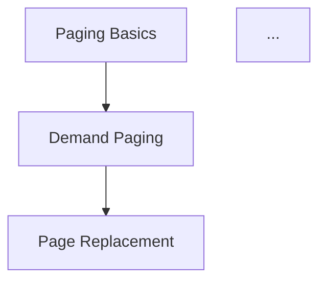

Read all OS chapter files in docs/ (ch5.md, ch6.md, ch7.md, ch9.md, ch10.md, ch18.md) and generate a comprehensive topic graph.

## Output Structure

Create `references/topic_graph.md` with:

### 1. Topic Inventory
For each chapter, extract:
- Main topics (e.g., "Round Robin Scheduling", "Page Replacement Algorithms")
- Subtopics (e.g., "FCFS", "SJF", "FIFO", "LRU", "Optimal")
- Key terminology that could be quizzed

### 2. Prerequisite Graph
For each topic, identify:
- **Hard prerequisites**: Must know X before Y (e.g., must understand paging before page replacement algorithms)
- **Soft prerequisites**: Helps to know X for Y (e.g., CPU scheduling understanding helps with thrashing analysis)

Format as:
```
topic_id:
  name: "Human readable name"
  lecture: 5
  prerequisites: [topic_id, topic_id]
  soft_prerequisites: [topic_id]
```

### 3. Difficulty Tiers
Assign each topic a difficulty (1-5):
- 1: Definitions, basic properties
- 2: Simple operations, direct application
- 3: Multi-step reasoning, complexity analysis
- 4: Edge cases, comparing algorithms, trade-offs
- 5: Synthesis across topics, non-obvious connections

### 4. Topic Clusters
Group related topics for interleaved practice:
- Scheduling cluster: FCFS, SJF, Round Robin, Priority, Multilevel Queue
- Memory Management cluster: Paging, Segmentation, TLB, Page Tables
- Synchronization cluster: Mutex, Semaphores, Monitors, Condition Variables
- Page Replacement cluster: FIFO, LRU, Optimal, Clock Algorithm

### 5. Concept Connections
Identify cross-topic relationships:
- "Thrashing relates CPU scheduling to memory management"
- "Semaphores can be implemented using mutex locks and condition variables"
- "TLB misses relate to page table structure and affect virtual memory performance"
- "FIFO and LRU page replacement differ in Belady's Anomaly behavior"

## Output Format

```markdown
# OS Topic Graph

## Topics

### Chapter 5: CPU Scheduling
| ID | Topic | Difficulty | Prerequisites |
|----|-------|------------|---------------|
| C5.1 | ... | 2 | [] |

### Chapter 6: Synchronization Tools

## Prerequisite Graph (Mermaid)


## Clusters for Interleaved Practice
...

## Cross-Topic Connections
...
```

## Instructions

1. Read each chapter file carefully (ch5, ch6, ch7, ch9, ch10, ch18)
2. Extract ALL named concepts, not just headers
3. Infer prerequisites from how concepts are introduced
4. Be conservative with difficulty ratings (most intro content is 1-2)
5. Look for explicit comparisons made in the notes (algorithm tables, trade-off discussions)
6. Output to ${CLAUDE_PLUGIN_ROOT}/skills/os-tutor/references/topic_graph.md